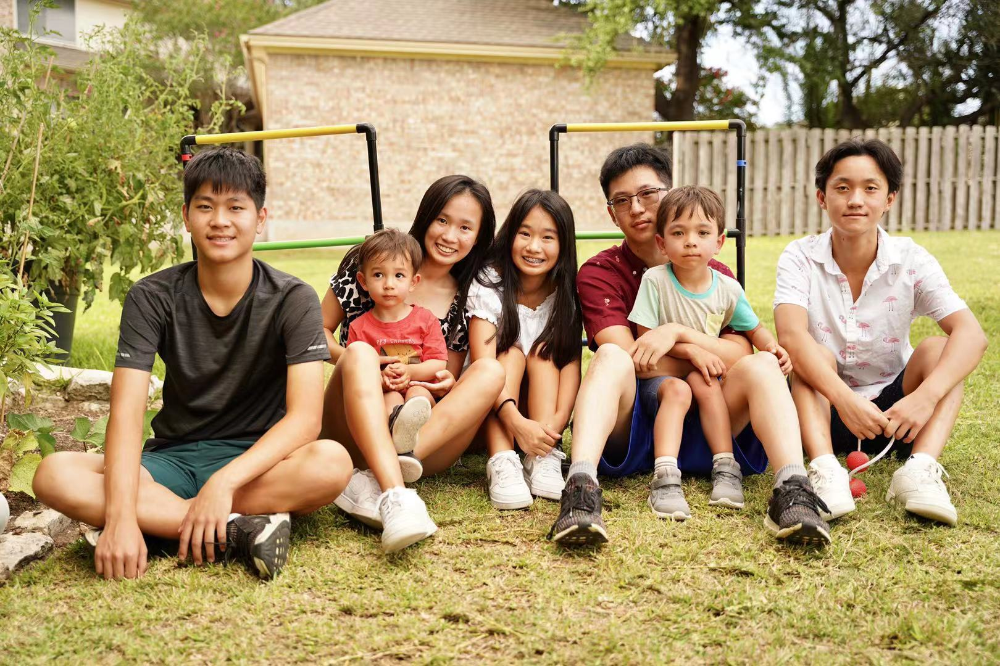
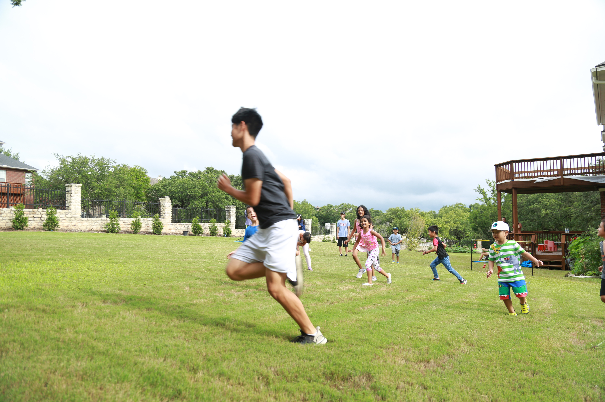
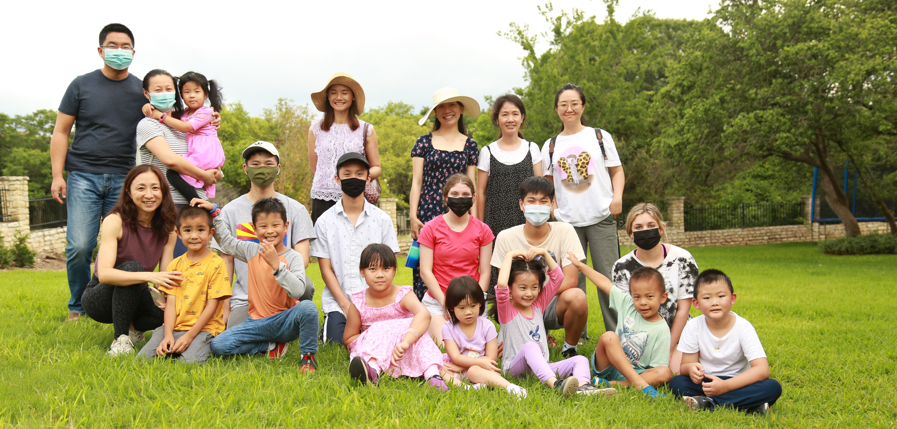
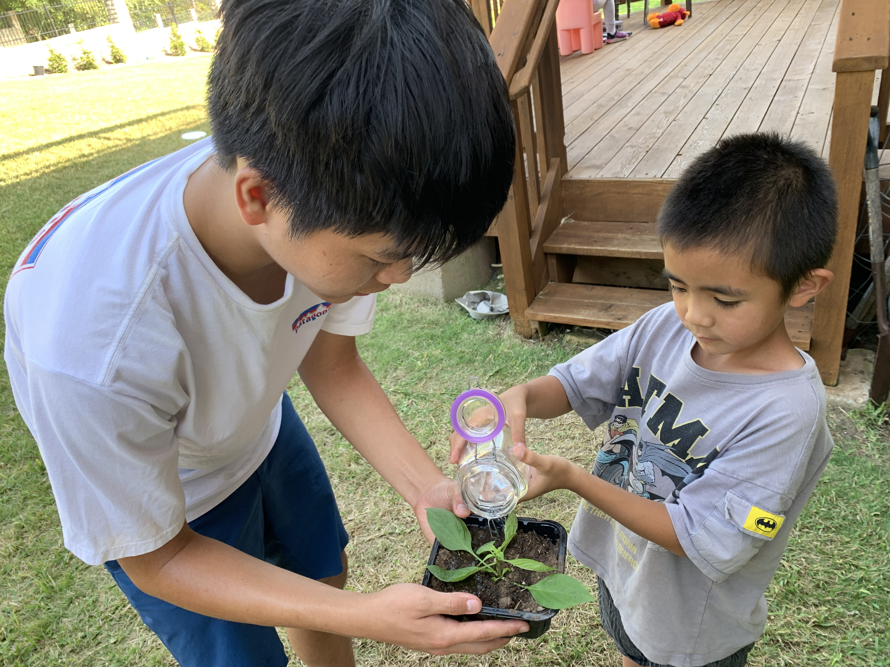
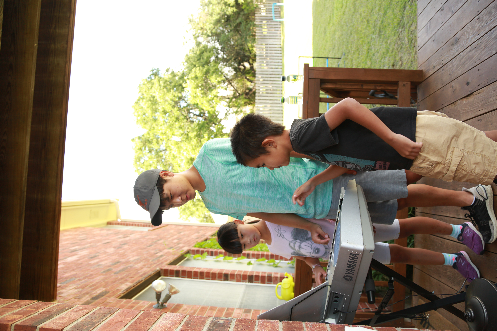
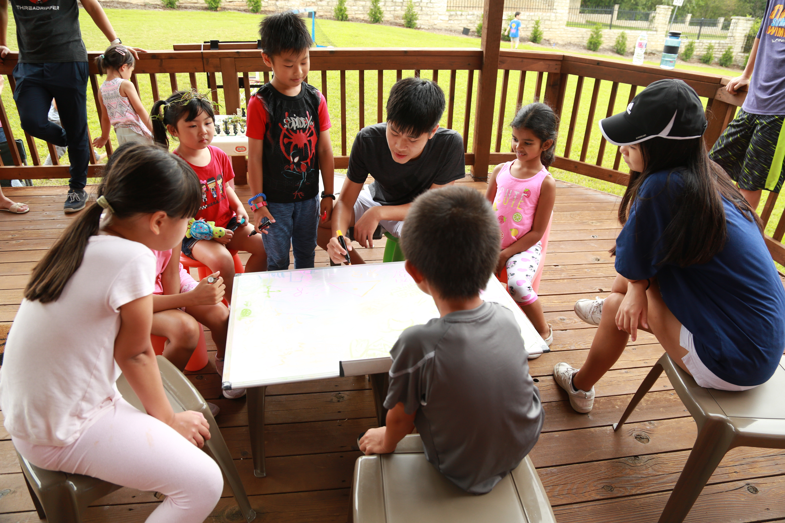
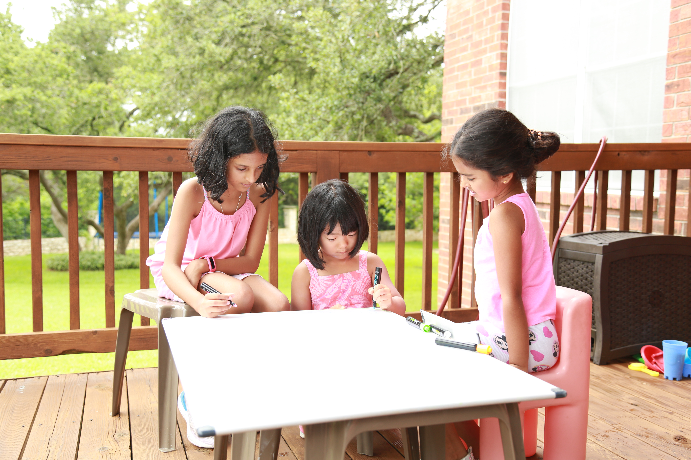
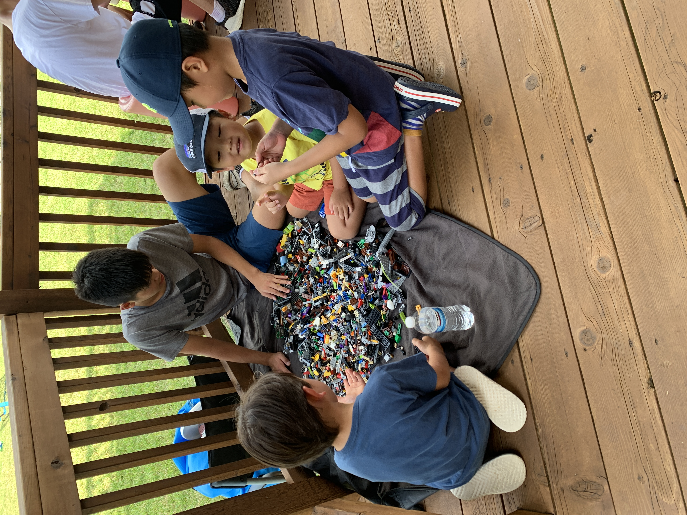
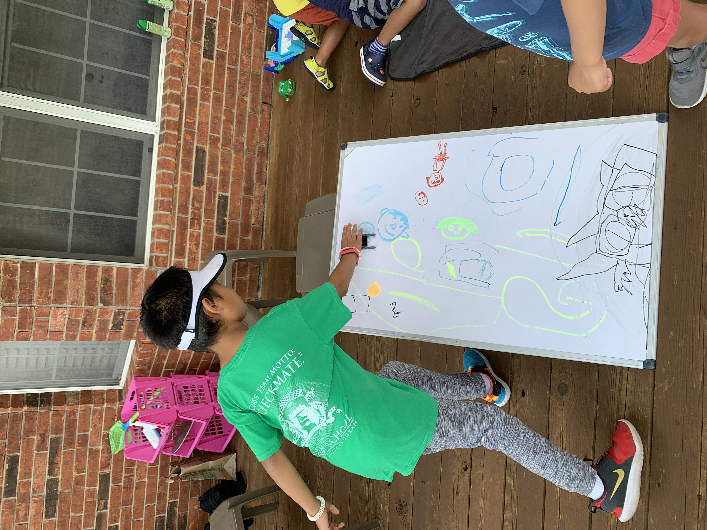

## Austin Strong Backyard Camp 

### Mission

* We want to provide young children the opportunity to form meaningful connections through an in-person backyard camp. 
* With this connection, away from electronics outside, we hope to foster their social skills and emotional development through gardening, STEM, music, and outdoor games. 
* After this twelve weeks long camp, we want to see that they are well prepared for in-person classes in the fall. 
* Some of them have never attended in-person school before, so this camp serves as a seed for young children to grow the "Austin Strong spirit." Whatever the new normal or new challenge may be, they are loved, supported, and will be strong to overcome it. 

### Members

Founder (est. May 2021): Charles Sun

Main members: Charles Sun, Allan Zhou, Joseph Zhou, Annie Li, and Amy Li

Backup members: Carly Barnett, Devin Dickey

### Curriculum
* Gardening/Natural Science -  Charles and Allan
* Music - Charles
* Math and Science - Allan and Joseph
* English/Chinese - Annie and Amy
* Holiday Celebrations/Outdoor Games - Team
* Camp Maintenance - Charles and Allan

### Camp Schedule
May 27th, 2021 to August 17th, 2021

4:00 pm - 6:00 pm

### Impact

* **The whole summer** - Rain or shine, the camp lasted for 12 weeks
* **Accumulated volunteer hours** - 1000+ hours
* **Served to diverse families** - Chinese/Indian/White
* **Total accumulated attendees** - 700+ attendees

### Video

<iframe width="560" height="315" src="https://youtu.be/wd1-REIJB7U" title="YouTube video player" frameborder="0" allow="accelerometer; autoplay; clipboard-write; encrypted-media; gyroscope; picture-in-picture" allowfullscreen></iframe>

### Team

Left to right from the first picture: Charles, Annie, Amy, Allan, and Joseph

    
    
### Garden Moments

### Music Moments

### Teaching Moments

     
     
### STEM Moments

### Sports Moments

