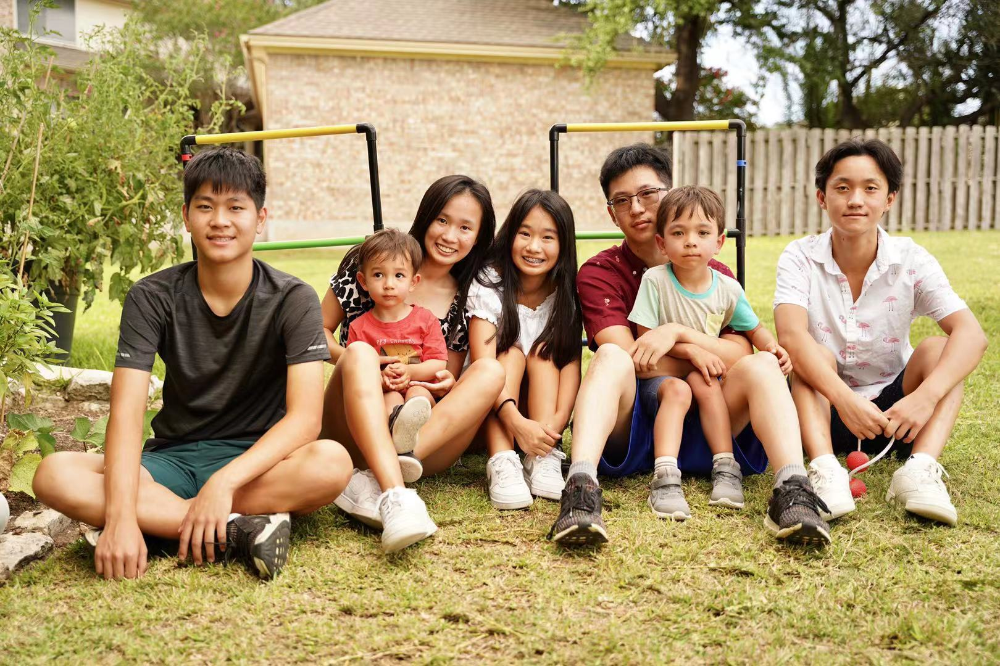

## 2021 Austin Strong Backyard Camp

### Mission

* We want to provide young children the opportunity to form meaningful connections through an in-person backyard camp. 
* With this connection, away from electronics outside, we hope to foster their social skills and emotional development through gardening, STEM, music, and outdoor games. 
* After this twelve weeks long camp, we want to see that they are well prepared for in-person classes in the fall. 
* Some of them have never attended in-person school before, so this camp serves as a seed for young children to grow the "Austin Strong spirit." Whatever the new normal or new challenge may be, they are loved and supported by us and will be strong to overcome it. 

### Members

Founder: Charles Sun

Main members: Charles Sun, Allan Zhou, Joseph Zhou, Annie Li, and Amy Li

Backup members: Carly Barnett, Devin Dickey

### Curriculum
* Gardening/natural Science -  Charles and Allan
* Music - Charles
* Math and Science - Allan and Joseph
* English/Chinese - Annie and Amy
* Holidays celebration/outdoor games - Team
* Camp maintenance - Charles and Allan

### Impact

* **The whole summer**- Rain or shine, camp lasted for 12 weeks
* **Accumulated volunteer hours**- 1000+hrs
* **Served to diverse families**- Asian/Indian/White
* **Total Accumulated Attendees**- 700+

### Team

Left to right for the top picture: Joseph, Amy, Charles, Allan, and Annie 

